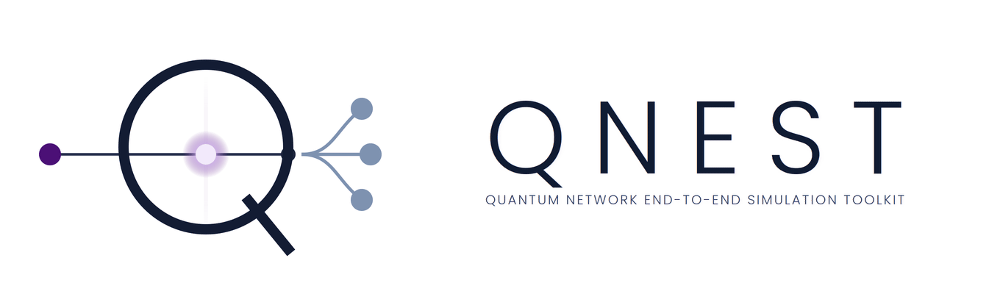

<p align="center">
  
</p>

<h1 align="center">QNEST</h1>
<p align="center"><strong>Quantum Network End-to-End Simulation Toolkit</strong></p>
<p align="center">
  A GUI-driven framework for end-to-end simulation of optical quantum data centers.<br>
  Windows · macOS · Linux
</p>

---

## What it is

Quantum data centers connect multiple QPUs over an optical network, but the software for studying them
is split across three worlds: circuit frameworks that assume a single device, distributed compilers that
treat communication abstractly, and network simulators that don't compile or schedule circuits.

QNEST puts all five stages in one graphical environment:

| Stage | What happens | Built on |
|---|---|---|
| **Circuit** | Choose the benchmark circuit and the number of qubits; set gate and process durations | MQT Bench |
| **Network** | Define the topology and the connectivity between QPUs: beam splitters, switches, quantum memories, optical links | — |
| **Distribute** | Compile the circuit against that network and distribute it across the QPUs | pytket-dqc |
| **Schedule** | Pass the distributed circuit to the QPUs and schedule it, then export an interactive Gantt chart as HTML | Qoala, NetSquid |
| **Run** | Apply the switching protocols for an all-photonic or memory-assisted architecture, and report results as detailed tables | — |

Circuit scheduling and entanglement generation rest on published, validated frameworks rather than
in-house heuristics. [Qoala](https://arxiv.org/abs/2502.17296) and NetSquid are both from TU Delft.

Every component is configurable: qubit count, T1 and T2, gate error, readout error, noise model, and
calibration data fetched from a named backend.

## At ECOC 2026

QNEST is a demonstration at ECOC 2026 — **demo D22**, Tuesday 22 September, 11:00–12:30, Pavilion 1
demo area. The abstract was accepted under the project's former name, GsOQDC.

## Metrics reported

- Entanglement fidelity
- Job execution time (JET)
- Inter-QPU communication overhead
- Entanglement-resource utilization
- Penalty delay caused by entanglement unavailability

Results are reported as detailed tables so every event, delay and allocation stays visible; plots are
generated from those tables for final figures.

## Install

Download a build for your platform from the [releases page](https://github.com/qnest-toolkit/qnest/releases),
or run from source:

```bash
git clone https://github.com/qnest-toolkit/qnest.git
cd qnest
pip install -r requirements.txt
python src/main.py
```

Python 3.10 or newer.

## Repository layout

```
QNEST/
├── src/                  GUI source code
├── assets/               application resources and screenshots
├── docs/                 the website (GitHub Pages)
│   ├── index.html
│   ├── style.css
│   └── images/
├── print/                brochure, handout and business card
│   ├── brochure.html     4 panels, 2 × A4 landscape, fold once
│   ├── handout.html      1 × A4 portrait
│   ├── card.html         85 × 55 mm, front and back
│   ├── print.css         shared theme for all three
│   ├── make-pdfs.py
│   └── *.pdf
├── README.md
├── LICENSE
├── .gitignore
└── requirements.txt
```

## Print pieces

`print/` holds a brochure, a one-page handout and a business card, built on the same theme as the
website and pulling from the same `docs/images/`. Edit the text in the `.html` files, edit
`print.css` for colour and type, then print from the browser (margins none, scale 100%, background
graphics on) or run `python print/make-pdfs.py`. See [print/README.md](print/README.md) for folding
and bleed details.

## Publishing the website

The site is a static page with no build step. On GitHub: **Settings → Pages → Source: Deploy from a
branch → Branch: `main`, folder: `/docs`**. It goes live at
`https://<user>.github.io/<repo>/`.

To preview locally:

```bash
python -m http.server 8000 --directory docs
# then open http://localhost:8000
```

### Before you publish

A few placeholders in `docs/index.html` need your real values:

- `https://github.com/qnest-toolkit/qnest` — repository and releases URL (appears in the nav, download
  cards, build instructions and footer)
- The BibTeX entry in the **Cite** section
- Team photos: `docs/images/team-01.png` and `team-02.png` are in place; the remaining authors show
  initials. Drop in `team-03.png` … `team-06.png` and swap the `<span class="member__ph--initials">`
  elements for `` to use photos instead.

## Citation

```bibtex
@inproceedings{elyasi2026qnest,
  title     = {QNEST: A GUI-Driven Interactive Framework for End-to-End
               Simulation of Optical Quantum Data Centers},
  author    = {Elyasi, Seyed Navid and Bahrani, Sima and Wang, Rui and
               Simeonidou, Dimitra and Monti, Paolo and Lin, Rui},
  booktitle = {European Conference on Optical Communication (ECOC)},
  year      = {2026}
}
```

## Team

**Chalmers University of Technology**, Department of Electrical Engineering, Gothenburg, Sweden —
Seyed Navid Elyasi, Paolo Monti, Rui Lin

**University of Bristol**, Smart Internet Lab, Bristol, United Kingdom —
Sima Bahrani, Rui Wang, Dimitra Simeonidou

Contact: [elyasi@chalmers.se](mailto:elyasi@chalmers.se)

## Acknowledgements

Supported by the Swedish Research Council (VR) and the UK EPSRC Integrated Quantum Networks Hub
(EP/Z533208/1).

## License

MIT — see [LICENSE](LICENSE).
